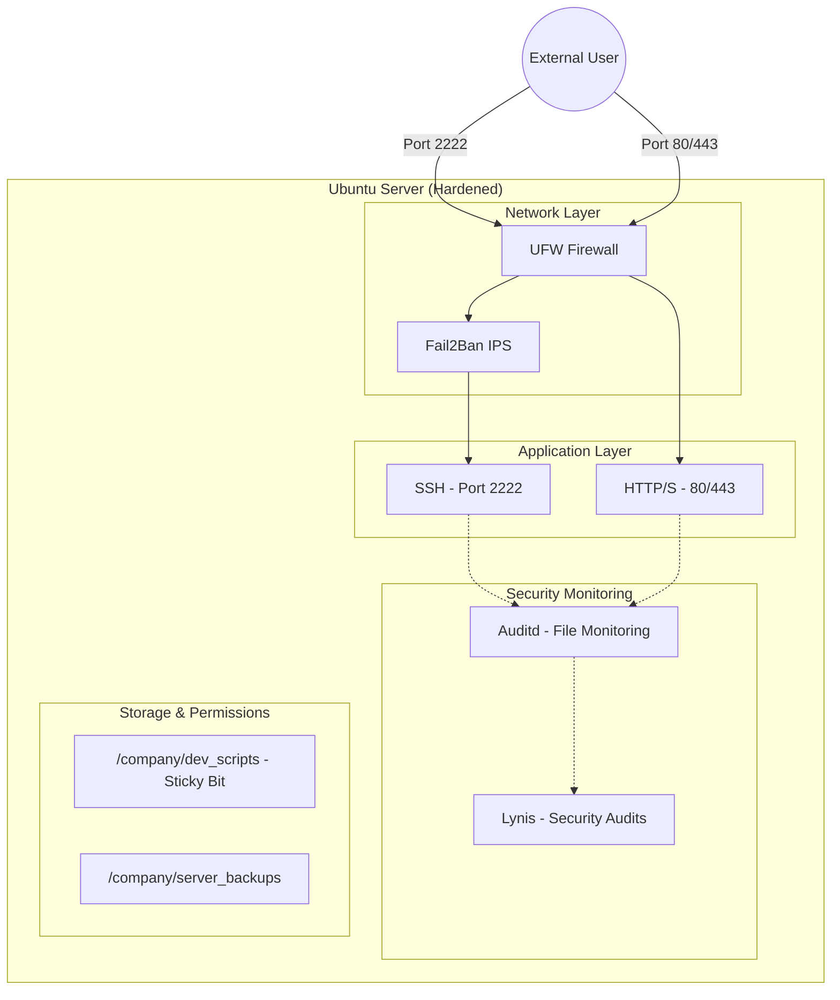

# Server Hardening Lab

A comprehensive project focused on securing a Linux environment, implementing granular access control, and automating system administration tasks. This lab simulates a corporate infrastructure setup with a focus on security best practices.

## Project Objectives
The goal of this project was to transform a vanilla Ubuntu Server installation into a production-ready, hardened environment by:
* Implementing a secure user hierarchy and permission model.
* Hardening network access via SSH (key-based auth, non-standard port).
* Configuring a host-based firewall (UFW) and intrusion prevention system (Fail2Ban).
* Integrating continuous system auditing and security compliance checks (Auditd, Lynis).
* **Enhancing the developer experience (DX) with a unified Zsh configuration.

## Architecture Diagram


## Tech Stack
* **OS:** Ubuntu Server LTS
* **Virtualization:** Vagrant (VirtualBox)
* **Shell:** Zsh (Oh-My-Zsh)
* **Network Security:** UFW (Uncomplicated Firewall), Fail2Ban
* **System Security:** OpenSSH, Systemd Sockets, Linux Permissions (POSIX)
* **Audit & Monitoring:** Auditd, Lynis
* **Automation:** Ansible, Bash Scripting, Cron

## Key Features & Implementation

### 0. Automated Deployment (Ansible & Vagrant)
* **One-Command Lab:** Spin up a fully hardened VM using `vagrant up`, which automatically triggers the Ansible provisioning.
* **Declarative Infrastructure:** Replicated the entire hardening logic into an Ansible playbook (`ansible/playbook.yml`) for idempotent, multi-node deployments.

### 1. Advanced User & Access Management
* **Hierarchical Structure:** Created dedicated groups (`sysadmins`, `devs`) and users (`alice`, `bob`) with restricted privileges.
* **Shared Directory Security:** Configured `/company/dev_scripts` with a **Sticky Bit (`+t`)**, ensuring users can only delete their own files within the shared group folder.

### 2. SSH Hardening (Zero-Trust Approach)
* **Port Remapping:** Moved SSH from port 22 to **2222** to reduce automated brute-force attacks.
* **Authentication:** Disabled password-based logins (`PasswordAuthentication no`) in favor of Public Key Authentication.
* **Systemd Override:** Resolved Ubuntu's `ssh.socket` conflicts by implementing systemd unit overrides to ensure custom port persistence.

### 3. Network Security
* **Firewall (UFW):** Configured a strict "Default Deny" policy for incoming traffic. Only essential ports are explicitly allowed: 2222 (SSH), 80 (HTTP), and 443 (HTTPS).
* **Intrusion Prevention (Fail2Ban):** Established a dedicated SSH jail. Users (IP addresses) are banned for 2 hours (7200 seconds) after 3 failed authorization attempts.

### 4. System Audit & Monitoring
* **Auditd:** Implemented robust daemon rules to monitor changes to critical system files (`/etc/passwd`, `/etc/shadow`, `/etc/ssh/sshd_config`, `sudoers`), network changes, and execution of root-level commands.
* **Lynis:** Automated the execution of `lynis` for routine OS security audits. Hardening scores and full reports are automatically generated and stored in `docs/audit_reports`.
* **Cron Monitoring:** Developed a Bash script (`sys_monitor.sh`) to log active users and system load averages.

## Getting Started

### Prerequisites
* Ubuntu Server 22.04+ (if running on bare metal)
* Vagrant & VirtualBox (for virtualized lab)
* Ansible
* Root or sudo access

### Option 0: Quick Start with Vagrant (Highly Recommended)
This creates a fresh Ubuntu VM and applies all hardening rules automatically.

```bash
vagrant up
```

### Option 1: Automated Deployment via Ansible (Recommended)
This approach is idempotent and handles the entire setup in one command.

```bash
cd ansible
ansible-playbook playbook.yml -i inventory.ini --ask-become-pass
```

### Option 2: Manual Module Execution (Bash)
You can run the full suite or individual scripts located in `scripts/`.

```bash
# Run the full installation
sudo ./install.sh
```

## Project Structure
```text
.
├── ansible/
│   ├── inventory.ini        # Target hosts for automation
│   └── playbook.yml         # Main hardening orchestration
├── configs/
│   ├── .zshrc-template      # Unified Zsh profile for all users
│   ├── audit.rules          # Ruleset for the auditd system daemon
│   ├── jail.local           # Fail2Ban configuration (limits and bans)
│   └── sshd_config          # Hardened OpenSSH configuration
├── scripts/
│   ├── deploy_omz.sh        # Mass-deploys Oh-My-Zsh for all users
│   ├── harden_firewall.sh   # Sets up UFW rules and policies
│   ├── harden_ssh.sh        # Configures SSHD and Systemd socket overrides
│   ├── run_audit.sh         # Executes Lynis audits and generates reports
│   ├── setup_audit.sh       # Installs auditd and loads the custom ruleset
│   ├── setup_fail2ban.sh    # Deploys and activates the jail.local config
│   ├── setup_users.sh       # Automates groups, users, and directory permissions
│   └── sys_monitor.sh       # Basic system audit script for Cron
├── install.sh               # Main entry point for Bash scripts
├── Vagrantfile              # VM definition and automation trigger
└── README.md